# Tier 2 Development - Video Cloud Skills Assessment

## By Tadeo Miranda


## Introduction

Technical test by Tadeo Miranda. In this document, I will attempt to explain in detail my logical process during the test and provide all necessary information and URLs of S3 buckets in AWS so that you can review the websites in action.

I would also like to mention that for the deployment in this project, I intended to follow an architecture using a Github repository to store the websites, connecting it to an AWS Pipeline so that it interacts with an S3 bucket, and from there send the bucket to an AWS CloudFront, the same steps I explain in this repository [AWS Tech Test Console CDK by Tadeo Miranda](https://github.com/Miranda12m/AWS-CDK-TechTest/blob/main/README.md).

However, due to time constraints and meeting the project's deadline, the websites are in public S3 buckets without restrictions (I know is a really bad practice but I did that just for Tech Test purposes)
Also if you go to the [Images Folder](https://github.com/Miranda12m/t2_videocloud_skills_assessment/tree/main/ImagesInfo) you can check my process deep.


## 1. Task
a) Using the player you created within your account, create a webpage that mutes
the player volume once the page is loaded;

b) After ten seconds, skip play progress forward automatically 20 seconds.
There are two ways that I can think of to do this part; one is a lot better than the
other!

### My Solution

a)
- First I had to send my videos to the media player that I created 
- I checked out this [Documentation URL and Video](https://player.support.brightcove.com/basics/developer-basics-autoplaying-video.html) also a cool video but the solution didn’t work to me
- So I tried the ‘muted’ and ‘autoplay’ attributes
- [Documentation URL Reference](https://player.support.brightcove.com/publish/available-options-advanced-page-embed-code.html)

b)

This part is taking me longer than I’d like to admin :c 
First because of the message ‘one is a lot better than the other’ I was trying to set up a skip button on the Player Configuration and on the JSON file replace the number 5 for a 20 and then calling the button after 10 seconds w a timeSet using JS

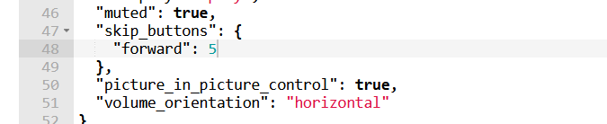

But when I replaced the 5 for the 20, the button just disappeared from the Player but didn’t work soooo now Im using Js Time out function to see if it works

So I just tryied w n addEventListener()

```javascript
document.addEventListener("DOMContentLoaded", function() {
            var video = videojs('myVideo');
            video.ready(function() {
                video.play();
                setTimeout(function() {
                    video.currentTime(video.currentTime() + 20);
                }, 10000); 
            });
        });
```

[---HERE THE WEBSITE RUNING ON AWS---](https://technicaltestbrightcove.s3.amazonaws.com/task01.html)


## Part 2
Using the below article as a reference; create an API call that retrieves all the videos in trial account 6415608796001, and provide the names and IDs of the videos.

- In the link at the PDF Document I was trying to find some API endpoints or something but I couldn’t… :c
- [DOC REFERENCE](https://apis.support.brightcove.com/general/concepts-api-tester.html)
- Here I found more information:
- [DOC REFERENCE](https://apis.support.brightcove.com/general/developer-tools/use-postman-api-requests.html)
- So Im going to test the API Requests using Postman, setting up the variables and environment as it says in the Docs and then request the access Token for user ‘6415608796001’ as it says at the PDF

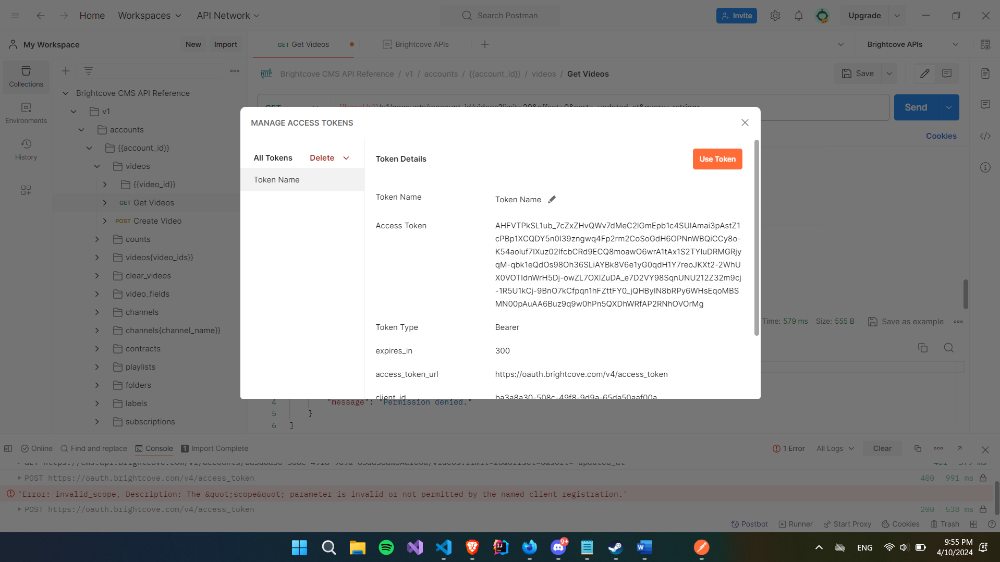

- Access denied….

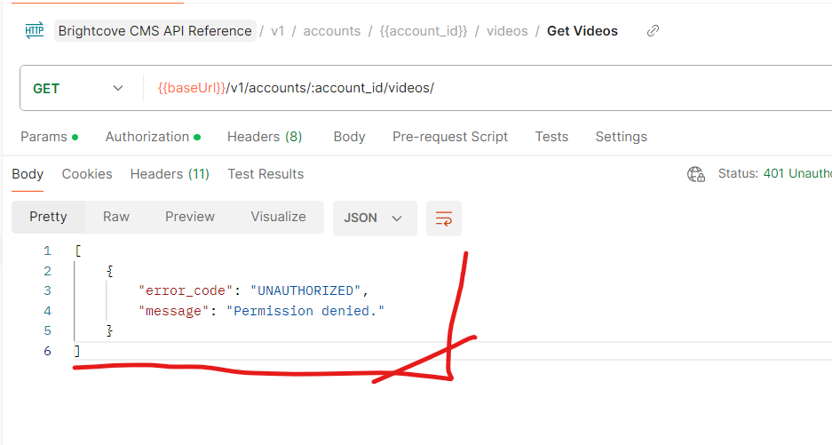

- After a couple of minutes I just realized that the docs don’t specify the API endpoints pretty well… would be better improve the API docs 
On the docs I found this endpoint as a GET method:
- [https://edge.api.brightcove.com/playback/v1/accounts/{{client_id}}/videos/ ]
- Then without the ‘playback’ and the ‘/’ but still not working :c I was keeping refreshing the access Token for the Oauth but sill not working, I double checked the setup, variables, requests etc but still stuck on this part :c

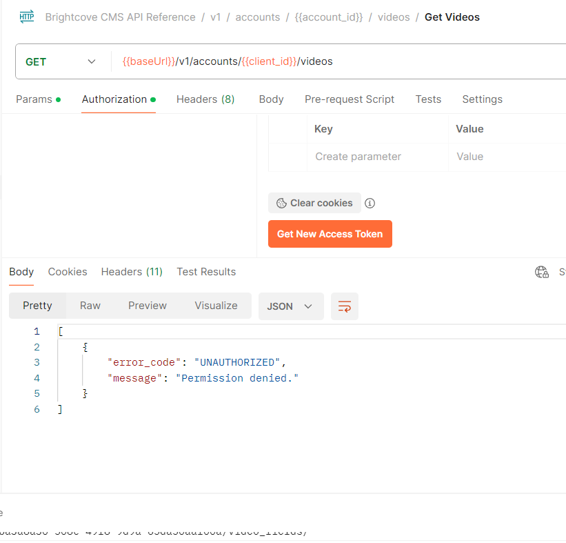

- I just spent more than 1 our trying to figure it out but I couldn't and there’s no manager or someone to ask for some help :c

I would like to share that I do have experience working with REST APIs, JWT, OAuth2, etc. I also have experience developing REST APIs in Python. On this occasion, I believe the reason for my unfamiliarity with this API and finding the documentation somewhat challenging was due to my lack of familiarity. However, I want to mention that I do have experience working with APIs.


## Part 3

Advertising is an important focus for us as Brightcove Support engineers.

- I found this at the Docs w a cool video so Im going to follow the video step by step
- [DOC REFERENCE](https://player.support.brightcove.com/plugins/advertising-ima3-plugin.html#issues)
- Now Im testing w the GoogleAds to validate the Tag that we r going to use
- [DOC REFERENCE](https://googleads.github.io/googleads-ima-html5/vsi/)
- Now I just created a new player to setup the Ad Tag
- I also added a style.css file to the player to make it look Pink
- And then added the Ad using Advanced Embed Code follow the Docs
- [DOC REFERENCE](https://player.support.brightcove.com/publish/available-options-advanced-page-embed-code.html)

```css
.vjs-ad-playing.vjs-ad-playing .vjs-play-progress { background-color: #ff33e7; }
.vjs-ad-loading .vjs-loading-spinner:after { border-top-color: #f153dc; }
```

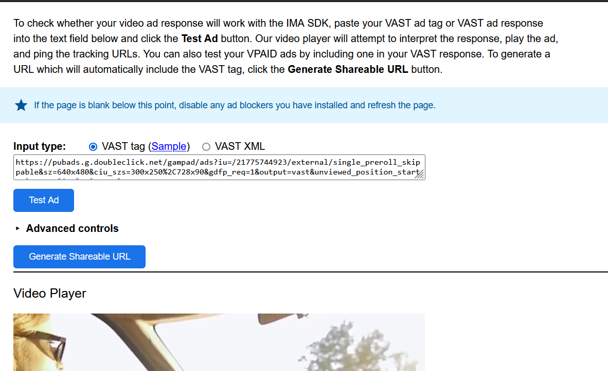
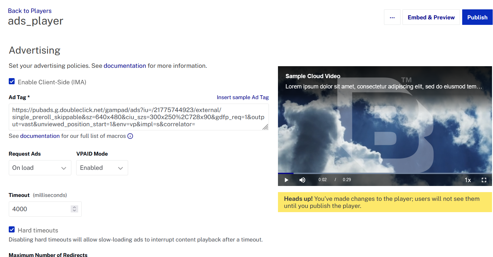
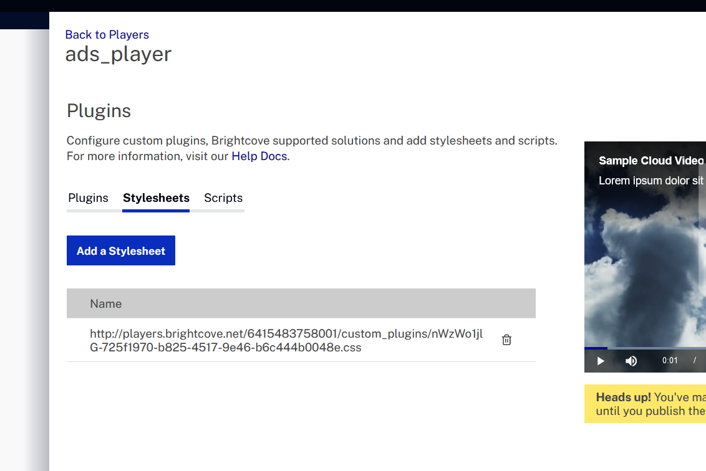


[---HERE THE WEBSITE RUNING ON AWS---](https://technicaltestbrightcove.s3.amazonaws.com/task02.html)


## Part 4
Following the Docs 
- [DOC REFERENCE](https://sdks.support.brightcove.com/android/basics/step-step-simple-video-app-using-native-sdk-android.html)
- Is working
- My project is located in this Repository at the files

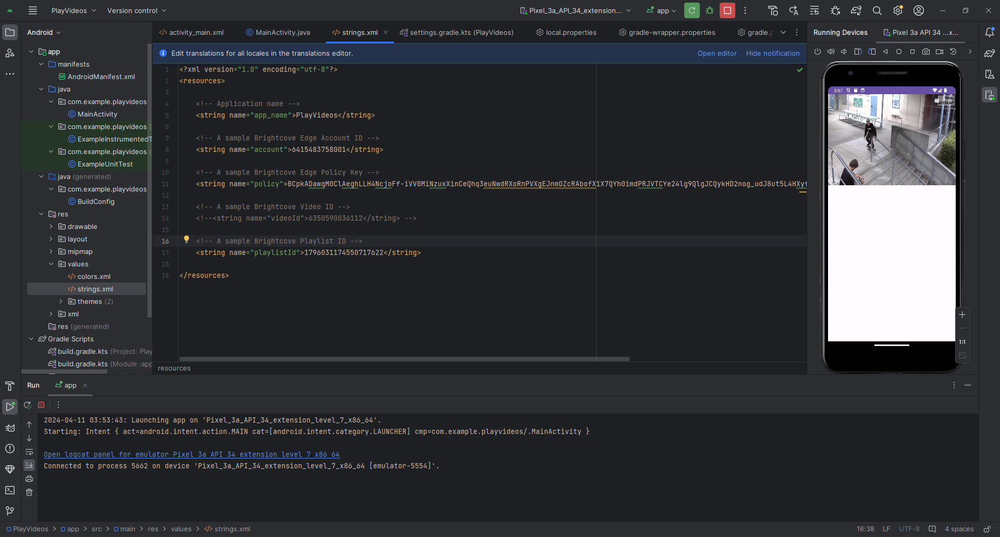
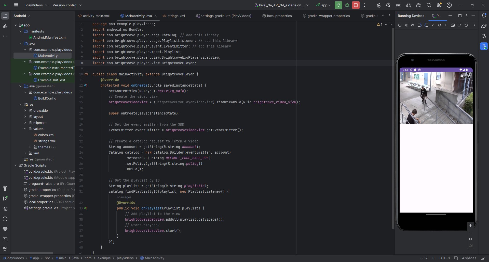


## Part 5
Upload a video using the Dynamic Ingest API.

[DOC REFERENCE](https://apis.support.brightcove.com/dynamic-ingest/getting-started/overview-dynamic-ingest-api-dynamic-delivery.html)

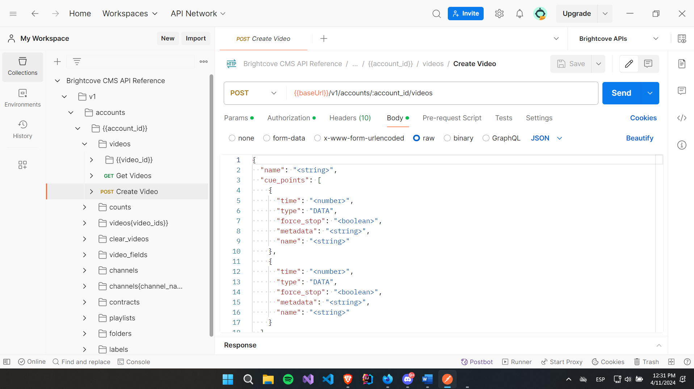


## Part 6
There are a lot of examples on the following page that show how to implement some
interesting solutions with our player.

- I Added some play and pause buttons, works perfect and they look pretty well just calling:
API Methods
- play( )
- pause( )
- I also added a Loop

[DOC REFERENCE](https://player.support.brightcove.com/code-samples/brightcove-player-sample-playpause-video-iframe-parent.html)
[DOC REFERENCE](https://player.support.brightcove.com/code-samples/brightcove-player-sample-creating-video-loop.html)

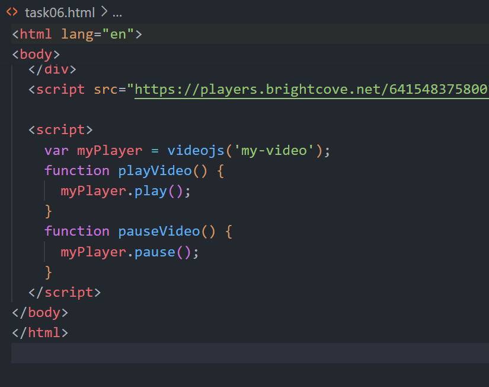

[---HERE THE WEBSITE RUNING ON AWS---](https://technicaltestbrightcove.s3.amazonaws.com/task06.html)


## Part 7
This one is a popular request from customers, and there are many correct ways to do it -
take a player and put it into a lightbox.

I didn’t make it and also take me a lot of time w the poster image so I just decided to delete the image and pass this task
And the way that I should Explain it to someone else it would be that we are going to call our functions getPlayer() and simpleLightbox()
And on our Js file 
When the video starts loading, it replaces the video player with its poster image inside a container. When you click on the poster image, it opens a lightbox with the video player inside, and when you click on a close button within the lightbox, it hides the lightbox and pauses the video.

[DOC REFERENCE](https://player.support.brightcove.com/code-samples/brightcove-player-sample-simple-lightbox.html)
[Github Reference](https://github.com/BrightcoveLearning/18163-simple-lightbox/blob/master/plugin/simple-lightbox.js)

[---HERE THE WEBSITE RUNING ON AWS---](https://technicaltestbrightcove.s3.amazonaws.com/task07.html)

## Part 8
Another real-world example here, and no clues this time! We have an intentionally
broken player/playback example
[WEBSITE REFERENE](http://cs1.brightcoveit.com/bclay/pages/20190000_BrightcoveSupportCandidateAssessment.html)

- I found a Browser console we have a 401 (Unauthorized)
- The request was made to the endpoint:
- https://edge.api.brightcove.com/playback/v1/accounts/4244402448001/videos/5188079836001
- but it was denied. The response headers indicate that the access to this endpoint is restricted….

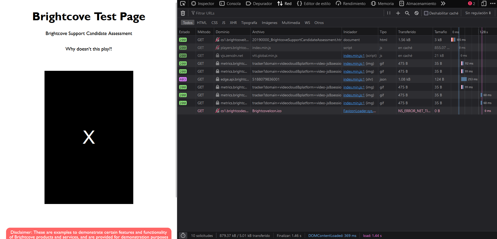


## Part 9
We made available the following page

[WEBSITE REFERENCE](https://cs1.brightcodes.net/simon/misc/homework/playbutton.html)

- First check the buttons
- After a couple of minutes checking the Browser Dev Kit I found that it was because the addEventListener

```javascript
document.querySelector(".vjs-play-control").addEventListener("click", function() {
    var videoPlayer = document.getElementById("brightcovePlayer");
    if (videoPlayer) {
        videoPlayer.play();
    }
});

```
